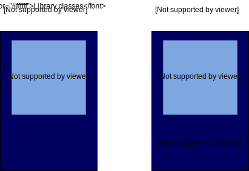

# NodeJs introduction course
<a href="https://nodejs.org/en/"></img></a>
As an asynchronous event-driven JavaScript runtime, Node.js is designed to build scalable network applications. In the following "hello world" example, many connections can be handled concurrently. Upon each connection, the callback is fired, but if there is no work to be done, Node.js will sleep.

<!-- Badges and tools required -->
[](https://nodejs.org/en/)

<!-- Table of content -->
## TABLE OF CONTENT

1.  [What is Nodejs?](#what_is_node)
2. [Fundamentals of Node.js](#fundamentals)
    - [Console](#console)
    - [Buffer](#buffer)
    - [File System](#file_system)
        - [Asynchronous](#async)
        - [Synchronous](#sync) 
3. [Event Loop](#event_loop)
4. [Globals](#globals)


<section id="what_is_node">

## What is Nodejs
<p style="color: #43853D; font-weight: 600">Node.js is an open-source, cross-platform JavaScript runtime environment used for executing JavaScript code outside of a web browser. <br>
Node.js is a great web framework for beginners because it works great for <strong style="color: red">data-intensive applications</strong>, like streaming and real-time apps, and Node.js makes it easy to start <strong style="color: red">building the back-end</strong>.<br>
Node.js allows us to <strong style="color: red">use JavaScript everywhere</strong> and on any browser, including MacOS, Linux, and Windows. When we say everywhere, we mean the front-end, the middle-ware, and the back-end. Node.js is, therefore, part of some very popular web development stacks, such as the <strong style="color: red">MERN</strong> stack, <strong style="color: red">MEVN</strong> stack, and <strong style="color: red">MEAN</strong> stack.</p>

</img>

> ### There are a number of characteristics that make Node.js what it is:

- <strong>Google Chrome V8 JavaScript Engine</strong>: This runtime environment is built on the Google Chrome V8 JavaScript runtime engine. In the same way a Java Virtual Machine translates bytecode, the Chrome V8 JavaScript engine takes JavaScript and makes it readable.
- <strong>Modules/Packages</strong>: Node.js has npm, a node package manager, with a library of over 350,000 packages to help get your project or application off the ground with efficiency and ease.
- <strong>Event Driven, Single-Threaded I/O Model</strong>: JavaScript relies on user interactions or events to run. In most cases, code is run synchronously. Server requests and other such asynchronous tasks rely on a system of promises or async/await functions to handle these inputs and outputs.

> ### Conclusion
> - Node.js is an open source server environment
> - Node.js is free
> - Node.js runs on various platforms (Windows, Linux, Unix, Mac OS X, etc.)
> - Node.js uses JavaScript on the server
</section>

<hr>

<section id="fundamentals">

## Fundamentals of Node.js

> Now that you know what Node.js is, let’s explore the fundamentals of this tool.

- [Console](#console)
- [Buffer](#buffer)
- [File System](#file_system)
<!-- Console section -->
<section id="console">

### Console

> The console is a module provided by Node.js that is akin to the JavaScript console in the browser when you inspect a webpage. The console has methods that are available for us to use for debugging purposes.

- <span style="color: red; font-weight: bold">console.log()</span>: Frequently used to log some sort of output.
- <span style="color: red; font-weight: bold">console.warn()</span>: Explicitly delivers a warning to the console.
- <span style="color: red; font-weight: bold">console.error()</span>: Explicitly delivers an error message to the console. You can log an error as a string or as an object. If logged as a new Error(), a traceback will be included as part of the message.
- <span style="color: red; font-weight: bold">console.trace()</span>: Logs a traceback when an error occurs in your code. Gives line number and column number of the file that the error probably occurred.
</section>
<!-- Console section ends -->

<!-- Buffer section -->
<section id="buffer">

### Buffer

At its core, the <strong>Buffer class</strong> in Node.js is a temporary storage solution for file systems. Due to its low-level nature, as web developers we will rarely actually use the Buffer class directly. The main purpose of this class is to allocate memory.

> Let’s take a look at a few methods that the Buffer class provides.

```javascript
const buf1 = Buffer.alloc(10);
console.log(buf1);

const buf2 = Buffer.alloc(5, 15);
console.log(buf2);

const buf3 = Buffer.allocUnsafe(10);
console.log(buf3);

buf3.fill(1);
console.log(buf3);

buf2.write("abcedf");
console.log(buf2);

const buf4 = Buffer.from([265, 6.5, -255, '7']);
console.log(buf4);

const buf5 = Buffer.from('Hello world');
console.log(buf5);

console.log(buf5.toString());
```


</section>
<!-- Buffer section ends -->

<!-- File system section -->
<section id="file_system">

## File System

The <strong>file system (fs) module</strong> allows us to interact with files in Node.js. There are synchronous and asynchronous methods that can be used to read or write to a file using the fs module. In contrast to using console or the Buffer class, we need to import the fs module into the file that we would like to use in order to get it to work.

The [code](#code) example below shows how the ```readFile```, an asynchronous method, works. Notice that the last argument in the method is a callback function whose first argument is an error. By definition this callback will always pass in the error first before the data.

- [Asynchronous](#async) 
- [Synchronous](#sync)

<!-- ASYNC section -->
<section id="async">

## Asynchronous

> The asynchronous nature of the ```readFile``` method doesn’t block other functions or lines of code from running.

### Example:
<section id="code">

```ruby
const fs = require('fs')
 
fs.readFile('data.txt', 'utf-8', (err, data) => {
 if (err) {
   console.error(err)
   return
 }
 let array = data.split('\n')

#  props are id, first_name, last_name, email, gender and ip_address

 let mapped = array.map(person => {
   let new_person = person.split(',');
   return new Object({
     id: new_person[0],
     first_name: new_person[1],
     last_name: new_person[2],
     email: new_person[3],
     gender: new_person[4],
     ip: new_person[5]

   })
 });
  console.log(mapped)

});
 
console.log("Hit!")

```

</section>

</section>
<!-- ASYNC section ends -->

<!-- SYNC section -->
<section id="sync">

## Synchronous

> The synchronous method, ```readFileSync```, however, blocks other lines of code from running until the file is finished reading.

### Example
```ruby
const fs = require('fs')

try {
  const data = fs.readFileSync('data.txt', 'utf-8')
  let array = data.split('\n')

#  props are id, first_name, last_name, email, gender and ip_address

 let mapped = array.map(person => {
   let new_person = person.split(',');
   return new Object({
     id: new_person[0],
     first_name: new_person[1],
     last_name: new_person[2],
     email: new_person[3],
     gender: new_person[4],
     ip: new_person[5]

   })
 });
  console.log(mapped)

} catch (err) {
  console.error(err)
}

console.log("Hit!")

```

</section>
<!-- SYNC section ends -->

Try placing a console.log(“Hit!”) after the function to see when the console is actually logged. Is there a difference between the two functions? What is it?

The readFile function will start the function and then immediately move to the rest of the code before the function completes and prints out the contents of our array. So you should see something like:

```console
Hit!
 
[
 {
   id: '1',
   first_name: 'Annabell',
   last_name: 'Cicconetti',
   email: 'acicconetti0@example.com',
   gender: 'Female',
   ip: '219.207.16.2'
 },
 etc…
]
```

> In contrast, the console.log(“Hit!”) won’t run until after the readFileSync function is finished:

```console
[...{
   id: '37',
   first_name: 'Arnoldo',
   last_name: 'Eakly',
   email: 'aeakly10@live.com',
   gender: 'Male',
   ip: '189.110.238.26'
 },
 {
   id: '38',
   first_name: 'Janis',
   last_name: 'Didball',
   email: 'jdidball11@shinystat.com',
   gender: 'Female',
   ip: '105.74.199.165'
 }
]
Hit!
```

Writing to files is done in a very similar fashion, but the functions are called ```writeFile()``` and ```writeFileSync()```.

With Node.js, dealing with files is fairly simple to do with the fs module.

</section>
<!-- File system section ends -->
</section>

<!-- Event Loop Section -->
<hr>
<section id="event_loop">

## Event Loop   

Much of Node.js is built to be __event-driven__. When a user clicks on an interface or types in a form, an event is triggered to happen and then something occurs as a result. To attach a function or set of functions to a specific event is emitting an event.

> These functions, called event listeners, are one part of an overall journey called the Event Loop. Take this example:

```ruby

const EventEmitter = require('events');
 
const emitter = new EventEmitter();
 
const handleEvent = (str) => {
 console.log(`================ ${str}`);
 console.log("handleEvent fired! An event has happened!");
 console.log("end of event")
}
emitter.on('load event', () => handleEvent("load"));
emitter.on('hello event', () => handleEvent("hello"));
emitter.emit('load event');
emitter.emit('hello event')
```

In this code example, we are importing the events module. Next, we create a new ```EventEmitter``` and assign it to the variable emitter. In this particular example, we created a ```handleEvent``` function that will serve as a callback function that will console.log some things. 

The ```EventEmitter``` class has several methods we can use. One method that is run when an event is emitted is the ```EventEmitter.on()``` function.

This particular method will fire when an event is emitted. The first argument passed into the function is the name of the event and the second is the callback function that tells us how to handle the event.

> In this particular example, there are two events being emitted. When we run the code above, we should get:

```console
================ load
handleEvent fired! An event has happened!
end of event
================ hello
handleEvent fired! An event has happened!
end of event
true
```

> The emit method triggers the on method which then invokes the handleEvent callback function.
</section>
<!-- Event loop ends -->
<hr>
<!-- Globals section -->
<section id="globals">

## Globals

Global objects are available in every module, so they can be used without importing a specific module. The ```Buffer``` class, for example, class is defined as a global in Node.js. Some other common global objects are:

- The ```console``` object is used to print to ```stdout``` and ```stderr```.
- Timers, such as ```setImmediate```, ```setInterval```, and ```setTimeout```, are also globals.
- The ```process``` object is also global.

> In a browser, the top-level scope is the global scope. But in Node.js, the top-level scope is not the global scope

In Node.js, the global object can be used to see whatever is available in the __global scope__. Run the code below to see an example.

```javascript
console.log(global)
```
</section>
<!-- Globals section ends -->
<hr>
<h3 align="left">Connect with me:</h3>
<a href="https://codesandbox.com/https://codepen.io/shanekolkoto" target="blank"></a>
<a href="https://linkedin.com/in/shane-morne-kolkoto" target="blank"></a>
<a href="https://discord.gg/Shane Kolkoto (web-dev)#7552" target="blank"></a>
<a href="https://github.com/ShaneKolkoto" target="blank"></a>
</p>

<h3 align="left">Support:</h3>
<a href="https://www.buymeacoffee.com/shanekolko" target="blank"></a>
